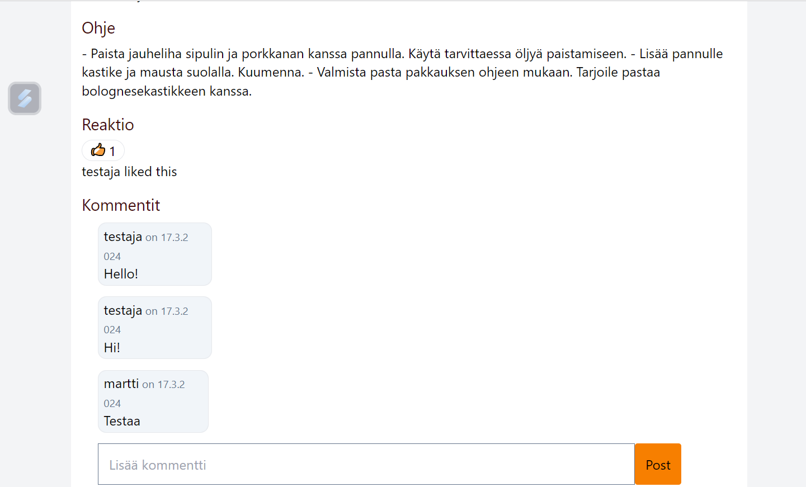
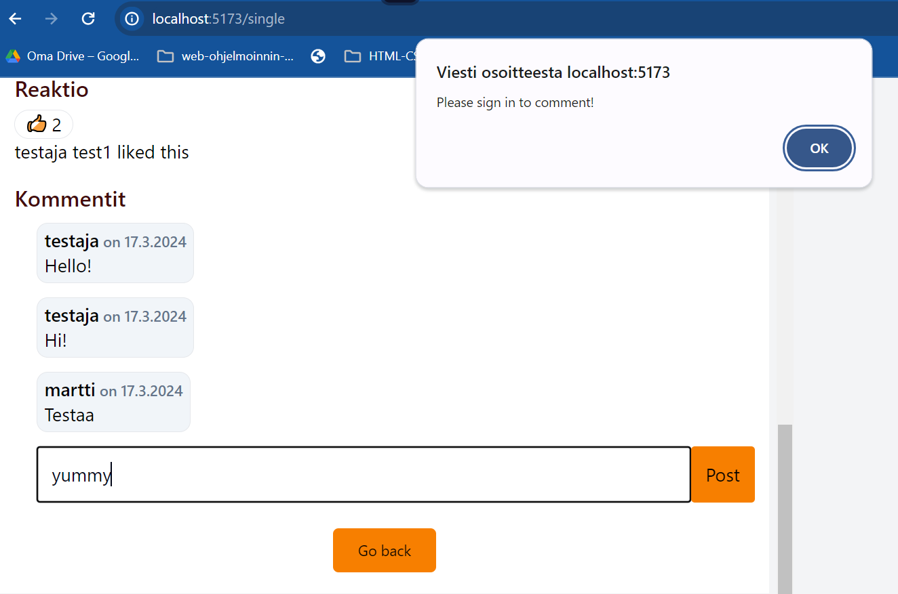

- [Linkki sovellukseen](http://10.120.32.50)
- [Linkki recipe-apiin](http://10.120.32.50/media-api/api/v1)
- [Linkki auth-apiin](http://10.120.32.50/auth-api/api/v1)
- [Linkki upload-apiin](http://10.120.32.50/upload-api/api/v1)
- [linkki API-dokumentaatioon]()

## Sovelluksen käyttöliittymä

## Tietokannan kuvaus

## Toiminnallisuudet

- Rekisteröityminen
  

- Kijautuminen ja linkit Rekisteröitymiselle
  

- Kirjautuminen ulos
  

- Reseptin luominen
  

- Suojatut reitit
  

- Tykkääminen kotisivulla ja reseptin tietosivulla

  - Tykkäysten määrä
  - Tykkää/poista tykkäys vain kirjautuneille
  - Tykättyjen listan näyttäminen kirjautuneille
    
    

- Kommentti
  - Näyttää kaikki kommentit
  - Tee kommenttia vain kirjautuneille
  - Poista oman kommentti
  - Päivitä oman kommentti
  - Toggle muokkauslomake
    
    

## Referenssit

https://github.com/ilkkamtk/hybridisovellukset
https://github.com/mattpe/hybrid-react-example24
